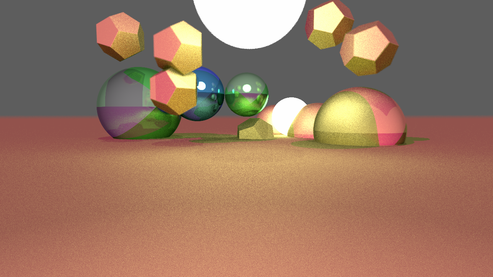

# Ray

Ray is a toy ray tracer that renders simple geometry and writes them to a bitmap file.



## Usage

This can either be compiled using the included Makefile or build batch file. By default the rendering will use AVX512 SIMD instructions. To utilize a GPU and OpenCL it can be compiled with 

```
make gpu
```

## License
[MIT](https://choosealicense.com/licenses/mit/)