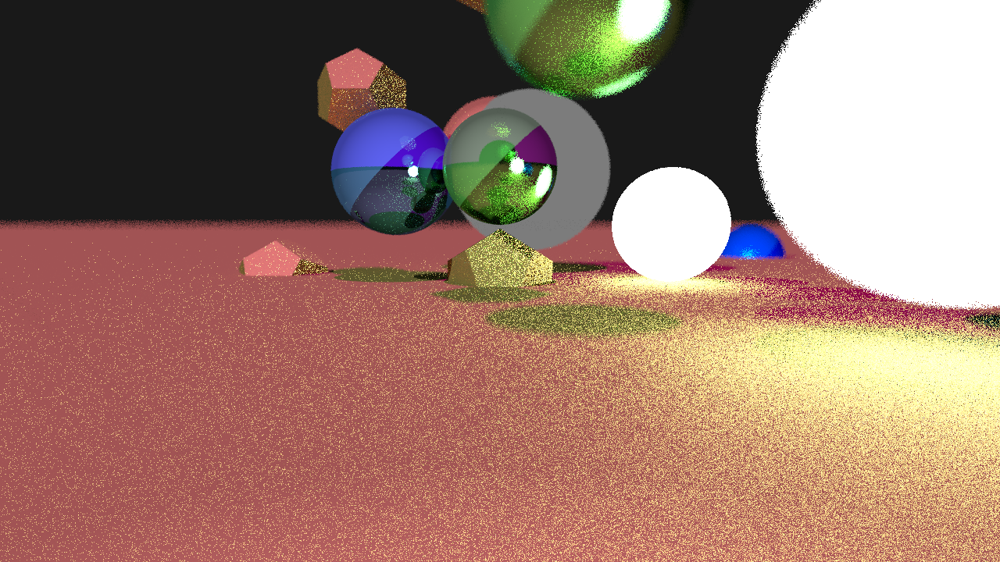
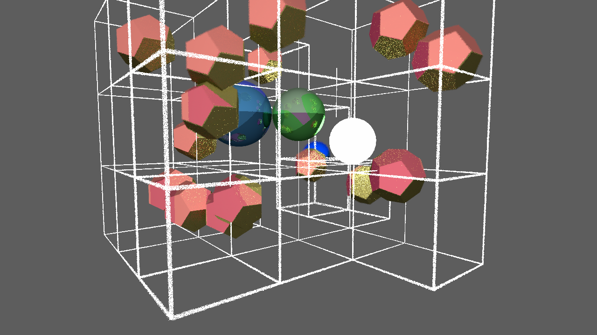

# Ray

Ray is a toy ray tracer that renders simple geometry and writes them to a bitmap file.





## Usage

This can either be compiled using the included Makefile or build batch file. By default the rendering will use AVX2 SIMD instructions and will try SSE instructions if AVX is not available. To utilize a GPU and OpenCL it can be compiled with 

```
make gpu
```

Currently not tested on Linux or Windows

